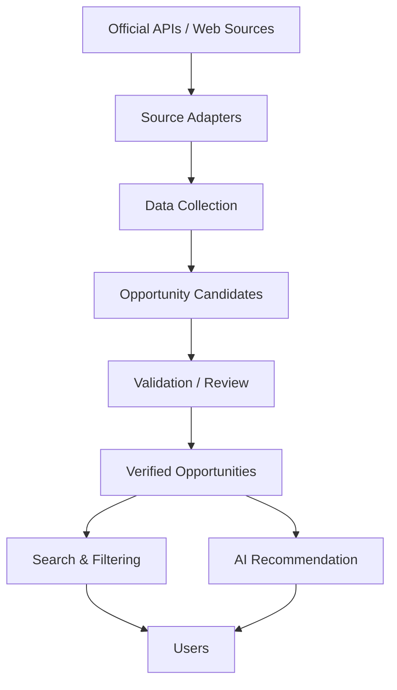
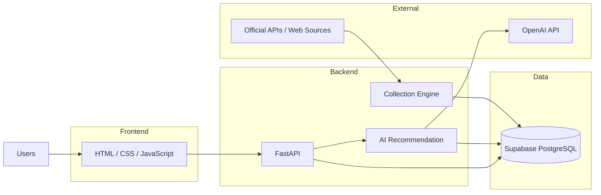
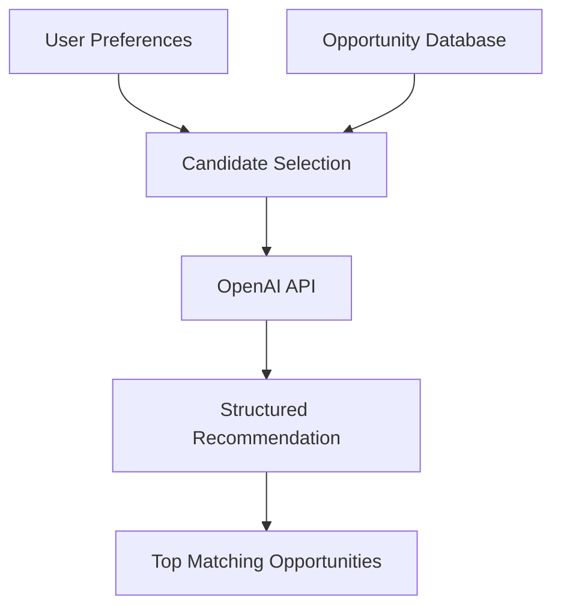

# AI PATH KOREA

**AI Opportunity Discovery Platform for Korea**

AI PATH KOREA is a free web platform for discovering AI-related education programs, competitions, hackathons, meetups, conferences, and other growth opportunities in Korea.

The platform collects and organizes fragmented AI opportunity information and provides search, filtering, and AI-powered personalized recommendations.

**Discover your next AI opportunity.**

---

## Live Service

- Production: https://aipath.kr
- Vercel: https://aipath-korea.vercel.app

---

## Key Features

### AI Opportunity Discovery

Search and filter AI-related opportunities including:

- Education programs
- Competitions
- Hackathons
- Meetups
- Conferences
- Workshops and other AI programs

### Opportunity Details

Each opportunity provides structured information such as:

- Organizer
- Application period
- Event period
- Location
- Participation fee
- Official source URL

### AI-Powered Recommendations

Users can enter preferences such as:

- Experience level
- Areas of interest
- Participation goals
- Preferred format
- Budget
- Available period

The system compares these preferences with opportunities currently stored in the database and recommends up to three relevant opportunities.

AI recommendations are restricted to verified opportunities stored in the platform database.

### Automated Data Collection

A source-based collection pipeline gathers AI opportunity information from multiple sources.

Depending on the source, the system uses:

- Official APIs
- HTML collection
- Source-specific adapters

Collected information is stored as candidates first rather than being immediately published.

Candidates can then be reviewed and promoted to verified opportunities.

---

## Data Collection Workflow



The collection pipeline separates raw collection results from publicly available opportunities.

Newly discovered data is first stored as an opportunity candidate. Candidates are reviewed and validated before being promoted to the verified opportunity dataset.

This workflow prevents unverified or failed collection results from being published directly to users.

---

## Tech Stack

| Area | Technology |
|---|---|
| Frontend | HTML, CSS, Vanilla JavaScript |
| Backend | Python, FastAPI |
| API Runtime | Vercel Serverless Functions |
| Database | Supabase PostgreSQL |
| AI | OpenAI API |
| Deployment | GitHub, Vercel |

---

## System Architecture



The frontend is implemented as static files and deployed through Vercel.

JavaScript handles user interactions, filtering, API requests, and rendering.

The backend is separated into Python serverless functions responsible for opportunity retrieval, AI recommendations, and automated data collection.

Supabase PostgreSQL stores structured opportunity and candidate data.

Sensitive credentials such as database secrets and AI API keys are handled only through server-side environment variables.

---

## Project Structure

```text
aipath-korea/
├── api/                 # Python / Vercel serverless functions
├── docs/                # Project documentation
├── public/
│   ├── css/             # Responsive UI styles
│   ├── js/              # Client-side logic
│   ├── index.html
│   ├── opportunities.html
│   ├── opportunity.html
│   ├── recommend.html
│   └── about.html
├── supabase/            # Database schema and seed data
├── requirements.txt
└── vercel.json
```

---

## Automated Collection

The collection engine supports source-specific collection strategies.

### Collection Sources

For sources providing official APIs, the system uses API-based collection.

For sources without confirmed APIs or RSS feeds, HTML collectors and source adapters are used to discover and validate opportunity URLs.

### Scheduled Collection

Vercel Cron triggers the collection endpoint twice per day.

Requests must pass authentication using server-side secrets before collection is executed.

### Candidate Review

Newly collected opportunities are stored separately as candidates.

The administrative review workflow supports states such as:

- Hold
- Exclude
- Ready for review
- Publish

Only validated opportunities are promoted to the public opportunity dataset.

---

## AI Recommendation Flow



The recommendation engine first selects relevant opportunities from the verified opportunity database based on the user's preferences.

Only the selected candidate opportunities are sent to the AI model.

The AI model compares the candidates with the user's preferences and returns structured recommendations containing up to three relevant opportunities.

To control latency and API usage, the recommendation process limits the number of candidate opportunities sent to the AI model.

The system is also designed to support:

- Recommendation caching
- Lighter AI models
- Summarized candidate data
- Rule-based fallback strategies

These strategies allow the recommendation system to scale as the opportunity dataset grows.

---

## Data Principles

AI PATH KOREA follows several principles to maintain reliable opportunity data.

- Application deadlines and actual event dates are stored separately.
- Each opportunity maintains its official source URL.
- Last verification time is recorded.
- Unverified source content is not automatically published.
- AI recommendations use only opportunities stored in the database.
- Recommendations do not guarantee eligibility or selection.

---

## Security

Production secrets are stored through environment variables and are not intended to be committed to the repository.

Sensitive values include:

```text
SUPABASE_URL
SUPABASE_SECRET_KEY
OPENAI_API_KEY
COLLECT_SECRET
CRON_SECRET
BIZINFO_API_KEY
```

If a credential is suspected of exposure, it is revoked and replaced rather than reused.

---

## What This Project Demonstrates

This project demonstrates practical experience with:

- Python backend development
- FastAPI
- REST API design and integration
- Web data collection
- Automated data pipelines
- Scheduled workflows
- PostgreSQL / Supabase
- OpenAI API integration
- AI-powered recommendation systems
- Serverless deployment
- Frontend/backend integration
- Production environment configuration
- Data validation workflows

---

## Project Status

**Active Development**

AI PATH KOREA is currently being developed and operated as a practical AI opportunity discovery platform for the Korean market.
